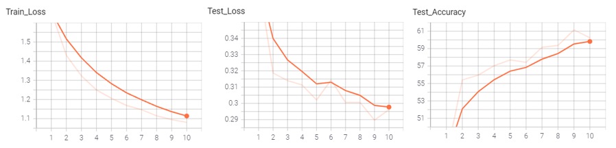

### HW1

---

##### 网络选择

选用LeNet作为分类网络，在Cifar-10数据集上进行训练。LeNet网络结构如图：

输入32 $\times$ 32的原图

Step1：6个5 $\times$ 5的卷积核，输出28$\times$28$\times$6的特征图；接着过一次池化操作（核大小为2$\times$2，步长为2）输出14$\times$14$\times$6的特征图 

Step2：16个5 $\times$ 5 $\times$ 6的卷积核，输出10$\times$10$\times$16的特征图；接着过一次池化操作（核大小为2$\times$2，步长为2）输出5$\times$5$\times$16的特征图 

Step3：120个5$\times$5卷积核，输出1$\times$1$\times$120的特征图

Step4：84个神经元的全连接层

Step5：10个神经元的全连接层（最后输出10分类）

损失函数：
$$
\sum^N_{k=1}||y_k-y_k^*||^2
$$
性能指标：

1）Loss尽可能小，但要注意别过拟合了

2）训练数据集、测试数据集Loss

3）测试数据集Accuracy

##### 实验结果

- **learning rate 对训练结果的影响**

1. **lr=0.01**, batch_size=4, epoch=10

2. **lr=0.05**, batch_size=4, epoch=10

3. **lr=0.001**, batch_size=4, epoch=10

​	学习率太大容易在极值点附近反复横跳，很难较快接近极值点，甚至有可能永远无法达到；学习率太小会导致训练效率变低

- **batch size对训练结果的影响**

1. lr=0.01, **batch_size=4**, epoch=10

2. lr=0.01, **batch_size=8**, epoch=10

3. lr=0.01, **batch_size=16**, epoch=10

​	适当增大batch size有利于提高训练效率，但过大的batch size容易使训练陷入局部极小值

- **epoch对训练结果的影响**

1. lr=0.01, batch_size=4, **epoch=10**

2. lr=0.01, batch_size=4, **epoch=20**

3. lr=0.01, batch_size=4, **epoch=40**

​	训练轮数太多会导致过拟合